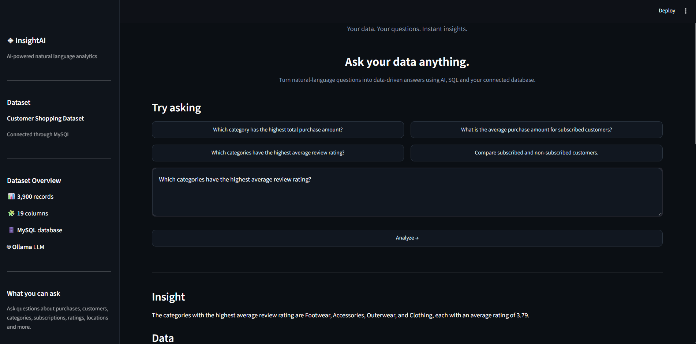
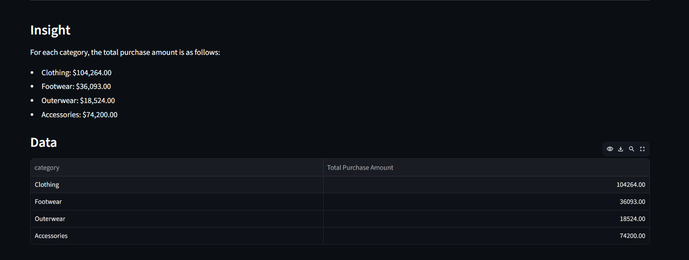
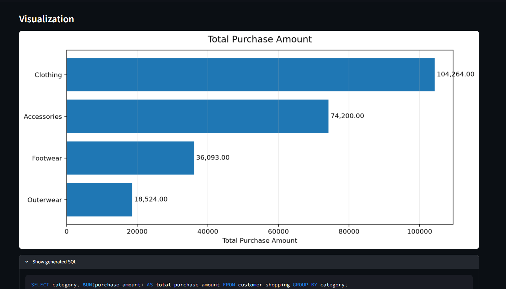

# InsightAI – AI Data Analyst

InsightAI is an AI-powered data analytics application that allows users to analyze MySQL data using natural-language questions instead of writing SQL manually.

Users can ask questions such as:

> Which category has the highest average purchase amount?

InsightAI uses an LLM to generate SQL, validates the query for security and semantic correctness, executes it against MySQL, and converts the results into understandable insights and visualizations.

---

## 📸 Screenshots

### InsightAI Interface

The main interface allows users to ask questions about the connected MySQL dataset using natural language.



### Data & AI-Generated Insight

InsightAI presents the query results in a structured table and generates a natural-language explanation of the result.



### Visualization & Generated SQL

For suitable analytical questions, InsightAI generates a visualization and allows users to view the SQL query generated by the LLM.



---

---

## 🚀 Features

- Ask data questions using natural language
- Automatically generate SQL queries using Qwen2.5-Coder 7B
- Conversational context for follow-up questions
- SQL security validation
- SQL semantic validation
- Automatic SQL repair when errors are detected
- Execute validated queries against MySQL
- Generate natural-language insights from query results
- Automatically generate visualizations for suitable results
- Display results in structured tables

---

## 🏗️ Architecture

```text
User Question
      ↓
Streamlit Interface
      ↓
Context Resolution
      ↓
Qwen2.5-Coder 7B
      ↓
SQL Generation
      ↓
Security Validation
      ↓
Semantic Validation
      ↓
SQL Repair (if required)
      ↓
MySQL Database
      ↓
Query Results
      ↓
Natural-Language Insight
      ↓
Visualization
